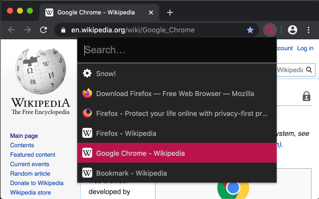
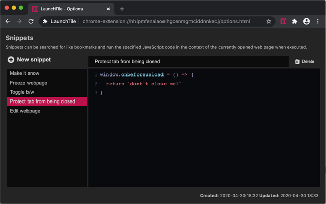

#  LaunchTile

Browser extension for swiftly opening bookmarks and running snippets

* Open the LaunchTile window with Strg+Q (⌘+E on MacOS) and start searching
* Results can be navigated using the keyboard (arrow keys + enter)
* Bookmarklets are detected as such and run in the context of the currently open tab
* Additionally, larger JavaScript snippets can be managed on the options page
* Initially, without search query, the most recently created bookmarks are shown

To change the hotkey go to chrome://extensions/shortcuts and look for _LaunchTile_.

## Install

[Chrome Web Store](https://chrome.google.com/webstore/detail/launchtile/jmcdhjepahpchldnembnbejniokgbbln)
